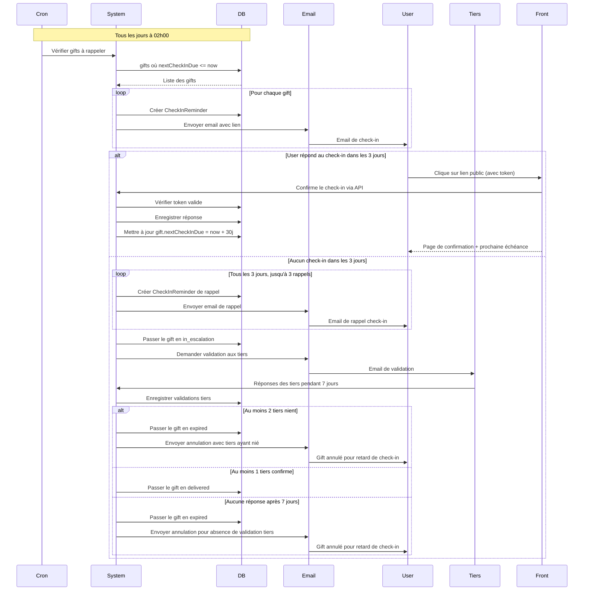
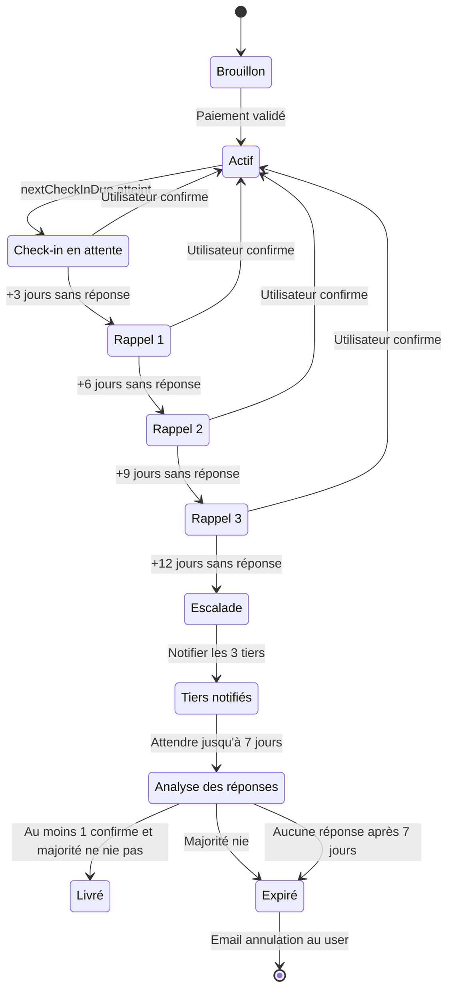
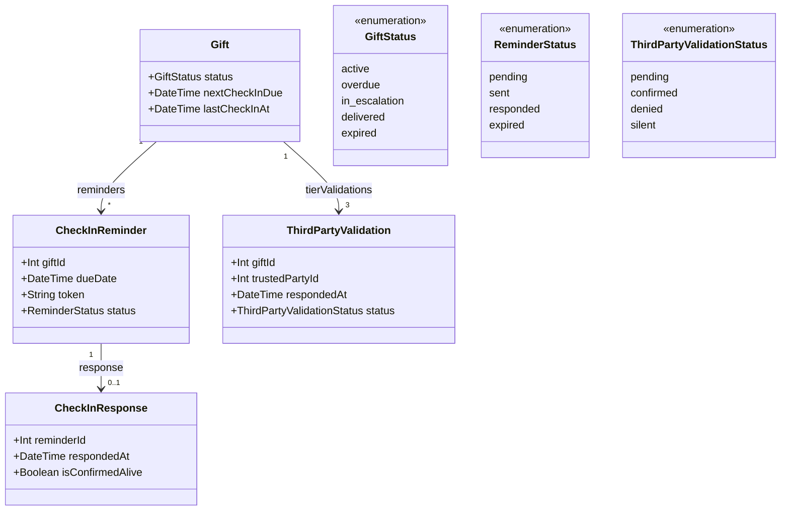

# UML - Check-in Retard (US-30) - Version Simple

## Contexte

Une fois qu'un gift est activé (paiement validé), l'utilisateur doit faire un check-in tous les 30 jours pour confirmer qu'il est toujours en vie.

En cas de retard prolongé, les 3 tiers ont 7 jours pour valider ou invalider. La majorité l'emporte : le gift est annulé si au moins 2 tiers nient, sinon il est livré si au moins 1 tiers confirme.

---

## Diagramme de Séquences Principal



---

## Diagramme d'États du Gift



---

## Diagramme de Classes (Entités Principales)



---

## Timeline

```
T = 0 jour   : Gift activé
T + 30 jours : Email de check-in mensuel
T + 33 jours : 1er rappel
T + 36 jours : 2ème rappel
T + 39 jours : 3ème rappel
T + 42 jours : Escalade vers tiers de confiance
T + 49 jours : Livraison si au moins 1 tiers confirme et majorité ne nie pas
T + 49 jours : Expiration si majorité nie ou si aucun tiers ne répond
```
